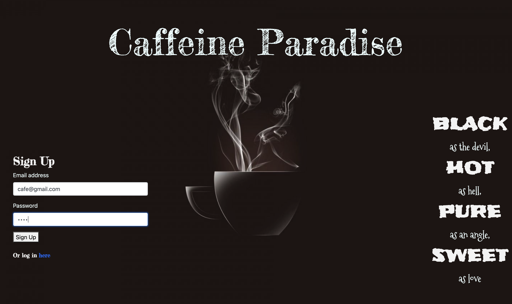
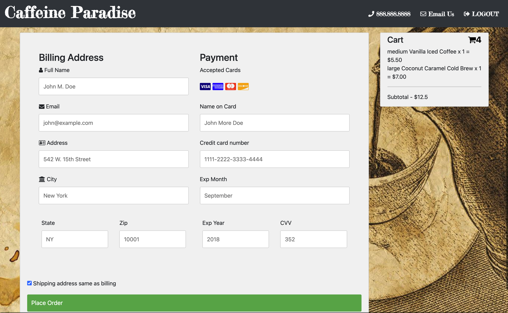
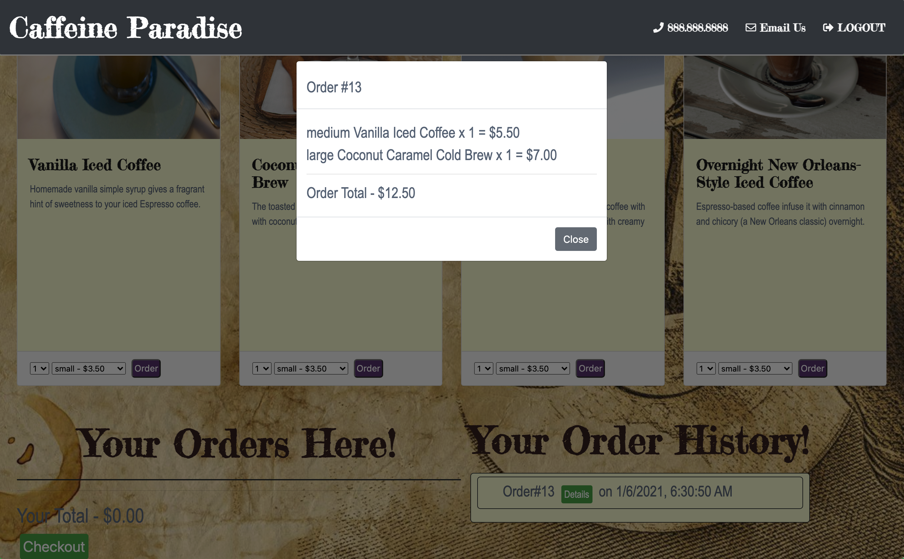

# CaffeinParadise2 

## Table of Content

- [Description](#Description)
- [Installation Dependencies](#Installation-Dependencies)
- [Contributing](#Contributing)
- [Usage Instructions](#Usage-Instructions)
- [Demo](#Demo) - [DemoLink](https://drive.google.com/file/d/1MFY67oxR2qqQhOf_H_OABGrdScNNvAWZ/view?usp=sharing)
- [Deploy](#Deploy) - [HerokuLink](https://caffeinparadise2.herokuapp.com/signup.html)
- [Questions](#Questions)

## Description

- This application was created to promote a local business to be able to grow their business by having access online for their clients. As Seattle is regarded as a world center for coffee roasting and coffee supply chain management. Related to this, many of the city's inhabitants are coffee enthusiasts; the city is known for its prominent coffee culture and numerous coffeehouses. As being said, we created this application so, a clients will be able to order their coffees online for a quick and convenience process.

## Installation Dependencies

- npm init | npm install bcryptjs, body-parser, dotenv, express, express-handlebars, express-session, mysql, mysql2, passport, passport-local, patch-package, path, sequelize

## Contributing

Two contributers: Sai Purciful and April Yang.

## Usage Instructions

- A user have to sign in or login if already has an account to be able to use the application.  

 

- After sign in / Login, the user's email address shows in the header of memu page. The coffee shop name will deplay in the hearder by clicking the button of " Click me ".  

 

- User is able to click the order button to place his orders, and his orders will display in the " Your order Here " area with orders' detail and total price . When user is be ready to check it out,just click the Checkout button, and application will route to the check out page. 

 

- At the checkout page, the user will be able to put his credit card infomation and his orders will be appeared on Cart area with the order details and total price. When user is ready to pay, just click the Place order button to finish the order. 

 

- After user click th Place order button, the application will route to the memeber page again, then the user will be able to see his complete order in the " Your order history" area with the Detail button and order date and time. When user click the Detail button,the order history will display in the modal box with total price.

 

## Demo

[DemoLink](https://drive.google.com/file/d/1MFY67oxR2qqQhOf_H_OABGrdScNNvAWZ/view?usp=sharing)

## Deploy

This CaffeinParadise2 application is deployed on [Heroku](https://caffeinparadise2.herokuapp.com/signup.html).

## Questions

If you have any questions about this application, please feel free to reach us via the github link [GitHub](https://github.com/aprilyanggarwood/CaffeinParadise2/tree/main)
