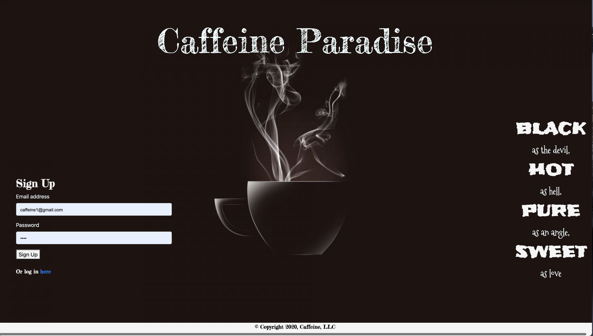
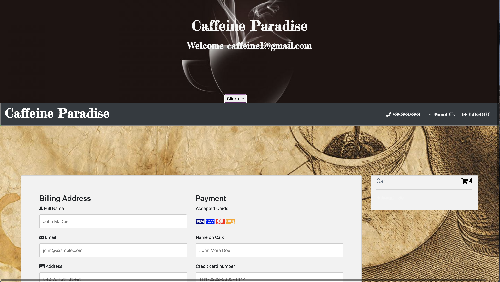

# CaffeinParadise 

## Table of Content

* [Installation Instructions](#Installation-Instruction)
* [Description](#Description )
* [License](#License)
* [Contributing Guildline](#Contributing-Guildline)
* [Tests Instructions](#Tests-Instructions)

## Installation Dependencies
* npm init | npm install bcryptjs, body-parser, dotenv, express, express-handlebars, express-session, mysql, mysql2, passport, passport-local, patch-package, path, sequelize

## Description
* This application was created to promote a local business to be able to grow their business by having access online for their clients. As Seattle is regarded as a world center for coffee roasting and coffee supply chain management. Related to this, many of the city's inhabitants are coffee enthusiasts; the city is known for its prominent coffee culture and numerous coffeehouses. As being said, we created this application so, a clients will be able to order their coffees online for a quick and convenience process.

## License

## Contributing 
* April Yang:  backend, 
* Suthunya Purciful: front end.

## Tests Instructions
* A user have to sign in or login if already has an account to be able to use the application.  

 

* After Sing in / Login, the user will be able to order coffee as show in the menu; select amount, size, and the price will be shown as the sizes different. 

 

* After the user place the order, the user will be able to pay by cards on checkout page and also will be able to see their order history. 

 

 

## Link to the project site. 
* coming soon
